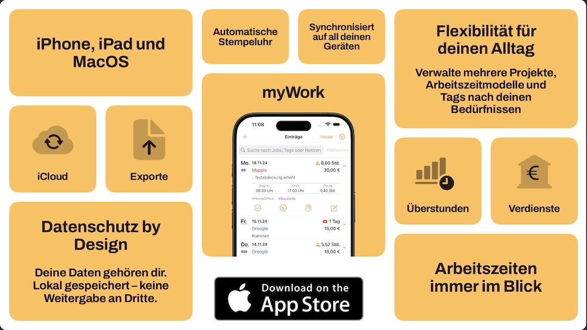

<!-- Main -->

<section id="hero" class="alt">
  

    <!-- Header Image -->
	
Zeiterfassung, die zu Dir passt!

    <header class="major">
      <h1>Effiziente Zeiterfassung: Einfach, Verlässlich, Sicher</h1>
    </header>
	

		
		
		
    	    
		<h3>Mit myWork wird Zeiterfassung kinderleicht und präzise. Spar dir den Stress und behalte den Überblick – für das, was dir wirklich wichtig ist.</h3>
    

  

</section>

<section id="problem-solution" class="alt">
  

    <!-- Headline -->
    <header class="major">
      <h2>Zeiterfassung, die dir den Rücken freihält.</h2>
    </header>

    <!-- Problem and Solution with Image -->
    

      <!-- Image Section -->
      

          
      

      <!-- Text Section -->
      

        <!-- Problem Section -->
        

          
Kennst du das auch? Papier-Stundenzettel, ungenaue Aufzeichnungen oder einfach das Gefühl, den Überblick zu verlieren? Zeiterfassung kann kompliziert und zeitaufwendig sein – aber das muss nicht sein.

        

        <!-- Solution Section -->
        

          
Mit myWork machst du Schluss mit Chaos und Aufwand. Egal, ob du für verschiedene Projekte arbeitest oder einfach nur deine Arbeitszeit im Blick behalten willst: myWork bietet dir eine einfache, präzise und zuverlässige Lösung.

        

		

      

        <h4>
          
            
          
          Schnell & Einfach
        </h4>
        
Starte die Zeiterfassung mit nur einem Klick und lass myWork den Rest erledigen – ohne deinen Akku zu belasten.

      

      

        <h4>
          
            
          
          Flexibel
        </h4>
        
Verwalte mehrere Jobs, Kunden oder Projekte und erfasse deine Zeiten individuell – sogar für Urlaub, Feiertage und Krankheit.

      

      

        <h4>
  			
    			
  			
  			Datenschutz
		</h4>
        
Deine Daten gehören dir. Sie bleiben sicher auf deinem Gerät – ohne Server und ohne Dritte. 

		<a href="/mobile-apps-privacy.html" class="button small">Datenschutzerklärung</a>
      

    	

  		

    

    <!-- Kernvorteile -->
    

    <!-- Optional Visual 
    

      

        
          
        
      

    
 -->
  

</section>

<section id="features" class="alt">
  

    <!-- Headline -->
    <header class="major">
      <h2>Alles, was du für deine Zeiterfassung brauchst – und mehr.</h2>
    </header>

    <!-- Einleitung -->
    
myWork kombiniert leistungsstarke Funktionen mit einer einfachen Bedienung, damit du deine Arbeitszeit effizient organisieren kannst. Entdecke die Features, die den Unterschied machen.

    <!-- Feature Highlights (2-Spalten-Layout) -->
    

      <!-- Feature 1 -->
      

        <h4>Verwalte deine Projekte mit Leichtigkeit</h4>
        
Egal, ob du für mehrere Kunden arbeitest oder an verschiedenen Projekten – behalte mit persönlichen Tags und flexiblen Arbeitszeitmodellen immer den Überblick.

      

      <!-- Feature 2 -->
      

        <h4>Synchronisierung über alle Geräte</h4>
        
Dank iCloud kannst du deine Daten sicher synchronisieren und hast sie immer und überall verfügbar – auf deinem iPhone, iPad und deiner Apple Watch.

      

      <!-- Feature 3 -->
      

        <h4>Automatisiere deinen Alltag</h4>
        
Automatische Pausen, ortsbasiertes Starten und Stoppen der Zeiterfassung und iCloud-Synchronisation sorgen für weniger Aufwand und mehr Effizienz.

      

      <!-- Feature 4 -->
      

        <h4>Behalte deine Arbeitszeiten und Verdienste im Blick</h4>
        
Direkt beim Start siehst du deine Sollarbeitszeit, Überstunden und Verdienste – übersichtlich und auf einen Blick. Unterstützt unterschiedliche Arbeitszeit- und Verdienstmodelle, damit du flexibel bleibst.

      

      <!-- Feature 5 -->
      

        <h4>Apple Watch & Dark Mode</h4>
        
Nutze myWork bequem von deiner Apple Watch aus, und passe die App mit dem Dark Mode perfekt an deine Umgebung an.

      

      <!-- Feature 6 -->
      

        <h4>Exportiere Zeiten kinderleicht</h4>
        
Erstelle mit Vorlagen individuelle Berichte für Projekte, Kunden oder deine persönliche Dokumentation.

      

      <!-- Feature 7 -->
      

        <h4>Sicherheit steht an erster Stelle</h4>
        
Deine Daten bleiben lokal auf deinem Gerät. Keine Server, keine Weitergabe an Dritte – 100 % Datenschutz.

      

    

    <!-- Visual 
    

      

        
          
        
      

    
 -->

    <!-- CTA -->
    <footer style="text-align: center; margin-top: 40px;">
      
<strong>Probiere myWork jetzt aus und entdecke, wie einfach Zeiterfassung sein kann.</strong>

      <a href="https://apps.apple.com/de/app/mywork/id487617582?l=de#?platform=iphone" class="button special">Jetzt ausprobieren</a>
    </footer>
  

</section>

<section id="faq" class="alt">
  

    <!-- Headline -->
    <header class="major">
      <h2>Häufig gestellte Fragen (FAQ)</h2>
    </header>

    <!-- FAQ Items -->
    

      <ul>
        <!-- FAQ 1 -->
        <li>
          <h4>Wie funktioniert die Zeiterfassung in der App?</h4>
          
myWork ermöglicht es dir, mit nur einem Klick die Zeiterfassung zu starten. Du kannst zwischen manueller Eingabe und automatisierter Stoppuhr wählen. Darüber hinaus gibt es die Möglichkeit, deine Arbeitszeit automatisch an deinen Arbeitsorten zu stempeln oder bereits erfasste Einträge zu kopieren.

        </li>

        <!-- FAQ 2 -->
        <li>
          <h4>Kann ich mehrere Projekte oder Kunden gleichzeitig verwalten?</h4>
          
Ja, du kannst beliebig viele Jobs, Projekte oder Kunden anlegen und mit persönlichen Tags deine Einträge gruppieren.

        </li>

        <!-- FAQ 3 -->
        <li>
          <h4>Wie werden die Daten zwischen meinen Geräten synchronisiert?</h4>
          
Deine Daten werden über iCloud synchronisiert, sodass du sie auf iPhone, iPad und Mac nahtlos nutzen kannst.

        </li>

        <!-- FAQ 4 -->
        <li>
          <h4>Was passiert, wenn ich die App während der Zeiterfassung schließe?</h4>
          
Kein Problem – myWork läuft im Hintergrund weiter und verbraucht kaum Akku. Beim nächsten Öffnen kannst du direkt an der letzten Stelle weitermachen.

        </li>

        <!-- FAQ 5 -->
        <li>
          <h4>Unterstützt die App unterschiedliche Arbeitszeitmodelle?</h4>
          
Ja, myWork bietet verschiedene Modelle wie Wochen-Sollstunden, Monatsstunden oder benutzerdefinierte Arbeitszeiten.

        </li>

        <!-- FAQ 6 -->
        <li>
          <h4>Kann ich Pausen automatisch erfassen lassen?</h4>
          
Ja, myWork hat eine automatische Pausenfunktion, die du individuell anpassen kannst.

        </li>

        <!-- FAQ 7 -->
        <li>
          <h4>Ist die App sicher?</h4>
          
Absolut. Deine Daten bleiben lokal auf deinem Gerät, außer du aktivierst die optionale iCloud-Synchronisation. Es gibt keine Server oder Datenweitergabe an Dritte.

        </li>

        <!-- FAQ 8 -->
        <li>
          <h4>Kann ich Berichte exportieren?</h4>
          
Ja, du kannst deine Zeiten über Vorlagen individuell exportieren – perfekt für Kunden, Projekte oder persönliche Dokumentationen.

        </li>

        <!-- FAQ 9 -->
        <li>
          <h4>Gibt es eine Unterstützung für Feiertage, Urlaub und Krankheit?</h4>
          
Ja, du kannst Aktivitäten wie Urlaub, Feiertage, Krankheit oder Kurzarbeit schnell und einfach manuell erfassen.

        </li>

        <!-- FAQ 10 -->
        <li>
          <h4>Ist die App auch ohne Internetverbindung nutzbar?</h4>
          
Ja, myWork funktioniert offline. Synchronisationen erfolgen automatisch, sobald du wieder online bist.

        </li>

        <!-- FAQ 11 -->
        <li>
          <h4>An wen kann ich mich wenden, wenn ich doch mal eine Frage oder ein Problem habe?</h4>
          
Unser Support-Team ist für dich da! Schreibe uns einfach eine E-Mail an <a href="mailto:sag.hallo@marcelruss.de">sag.hallo@marcelruss.de</a> oder nutze das Kontaktformular auf der Webseite. Wir helfen dir gerne weiter.

        </li>
      </ul>
    

  

</section>

<section id="reviews" class="alt">
  

    <!-- Headline -->
    <header class="major">
      <h2>Was Nutzer über myWork sagen</h2>
    </header>

    <!-- Kennzahlen -->
    

      

        <h3>Über 250.000 Downloads</h3>
        
myWork wird weltweit geschätzt und genutzt.

      

      

        <h3>Mehr als 50.000 aktive Geräte</h3>
        
myWork ist ein treuer täglicher Begleiter.

      

      

        <h3>Über 4.700 Top-Bewertungen</h3>
        
Unsere Nutzer bewerten myWork mit durchschnittlich 4,6 Sternen.

      

    

    <!-- Reviews -->
    

      <!-- Review 1 -->
      

        <blockquote>
          
"myWork ist ein echter Gamechanger! Ich habe endlich den Überblick über meine Arbeitszeiten."

          <footer>- App Store Nutzer</footer>
          <!-- Sterne -->
          

            ★★★★★
          

        </blockquote>
      

      <!-- Review 2 -->
      

        <blockquote>
          
"Sehr benutzerfreundlich und genau das, was ich gesucht habe. Perfekte Lösung für Freelancer!"

          <footer>- App Store Nutzer</footer>
          <!-- Sterne -->
          

            ★★★★★
          

        </blockquote>
      

      <!-- Review 3 -->
      

        <blockquote>
          
"Die Synchronisation zwischen iPhone und iPad ist einfach genial. Absolute Empfehlung!"

          <footer>- App Store Nutzer</footer>
          <!-- Sterne -->
          

            ★★★★★
          

        </blockquote>
      

    

  

</section>

<section id="cta" class="alt" style="text-align: center;">
  

    <!-- Headline -->
    <header class="major">
      <h2>Teste myWork jetzt – kostenlos und unverbindlich!</h2>
    </header>

    <!-- Beschreibung -->
    

      Die Basisversion von myWork ist ein Leben lang kostenlos nutzbar. 
      Probiere außerdem die Vollversion unverbindlich in der kostenlosen Testphase aus und entdecke, wie einfach Zeiterfassung sein kann.
    

    <!-- Call-to-Action -->
    <a href="https://apps.apple.com/de/app/mywork/id487617582?l=de#?platform=iphone" target="_blank" class="button special">
      Jetzt im App Store herunterladen
    </a>
  

</section>

